# 👋 Olá! Eu sou o **Israel Henrique**

### 🚀 Sobre mim

Sou **Desenvolvedor Front-end** na **Prefeitura de Cajamar**, onde crio soluções digitais que melhoram a experiência dos usuários.  
Estou no início da carreira, mas com uma motivação gigante: **aprender, evoluir e construir interfaces funcionais e atraentes**.  
Unindo **design** e **lógica**, transformo ideias em código de verdade. 💫

🔗 **Portfólio** → [isrique9.github.io/portfolio-IsraelH](https://isrique9.github.io/portfolio-IsraelH/)

---

### 💼 Tech Stack

  

---

### 📊 Estatísticas do GitHub

  
  

  

---

### 🌐 Onde me encontrar

  
  
  
  

---

⭐ **Obrigado pela visita!**  
Siga-me ou entre em contato – bora trocar uma ideia sobre tecnologia, design e código. 🚀
